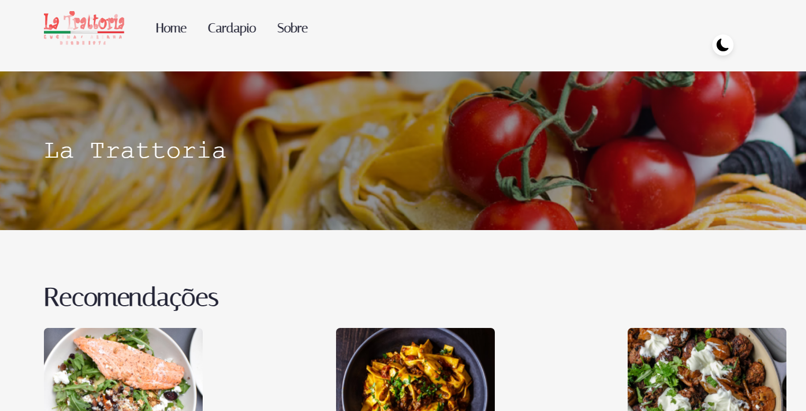
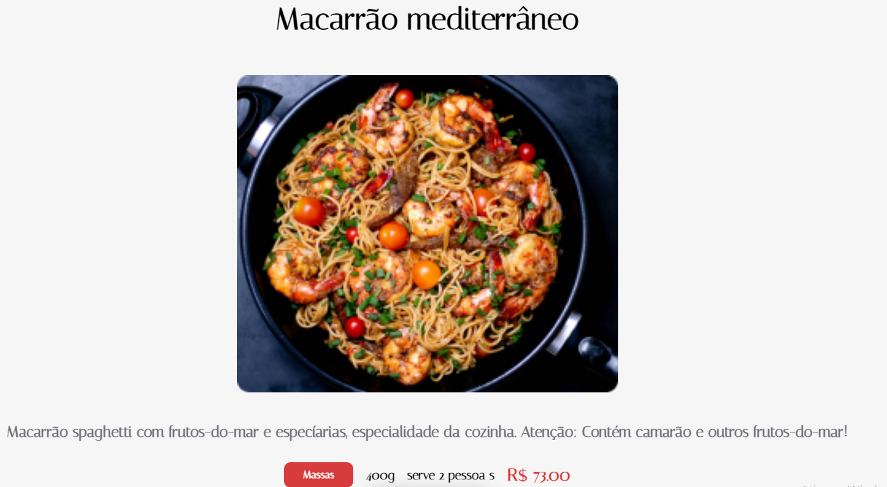
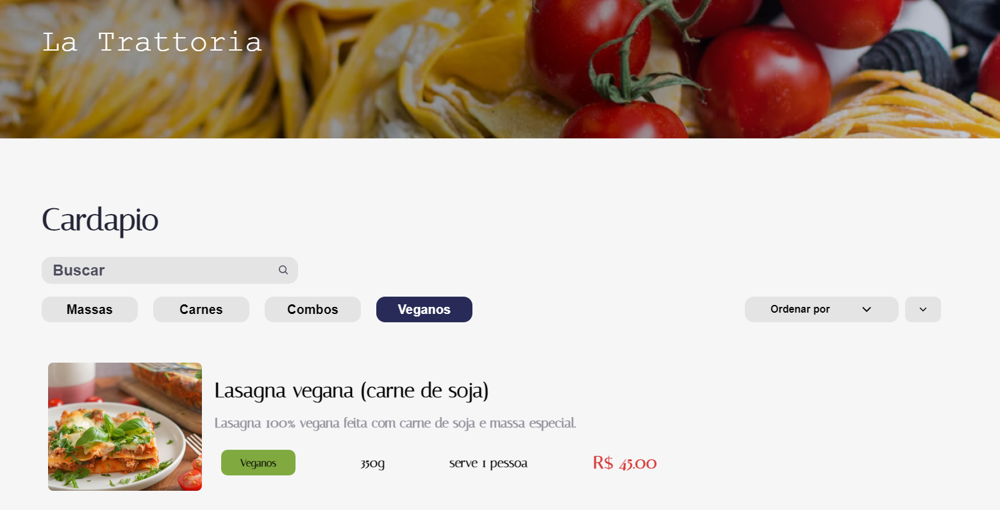

<h1 align="center"> 
	SPA (single page application) de restaurante - Projeto React/React-router-dom - TypeScript - SASS.
</h1>

Página de restaurante com cardápios.

| :placard: Vitrine.Dev |                                                                                                                  |
| --------------------- | ---------------------------------------------------------------------------------------------------------------- |
| :sparkles: Nome       | **La Trattoria**                                                                                                 |
| :label: Tecnologias   | React, TypeScript, JavaScript, SASS e HTML5                                                                      |
| :rocket: URL          | [https://restaurant-git-master-joaoricardom.vercel.app/](https://restaurant-git-master-joaoricardom.vercel.app/) |

 

 
## Detalhes do projeto

La Trattoria é um restaurante com seu cardápio online. Você pode escolher quais pratos prefere por valor, porção do prato e quantidade de pessoas para cada prato.

### Página de início

 

### Págnina de cardápio com seleção por categoria, busca e detalhes de pratos

 
 
 

### Página sobre

_Projeto feito durante curso de "React: Lidando com arquivos estáticos" e "React: Conhecendo a biblioteca React Router" da Alura._

# Novidades da versão 2.0

- Detalhes dos pratos
- Página de NotFound
- Melhoria na responsavidade
- Implementação para SPA
- Novos estilos paras as páginas

## Objetivos do projeto

- Estudos de:
  - React
  - CSS Modules
  - Responsividade
  - GIT Commits
  - normalize.css
  - Absolute imports
  - SVGR
  - Imports dinâmicos
  - React Router DOM
  - SPA
